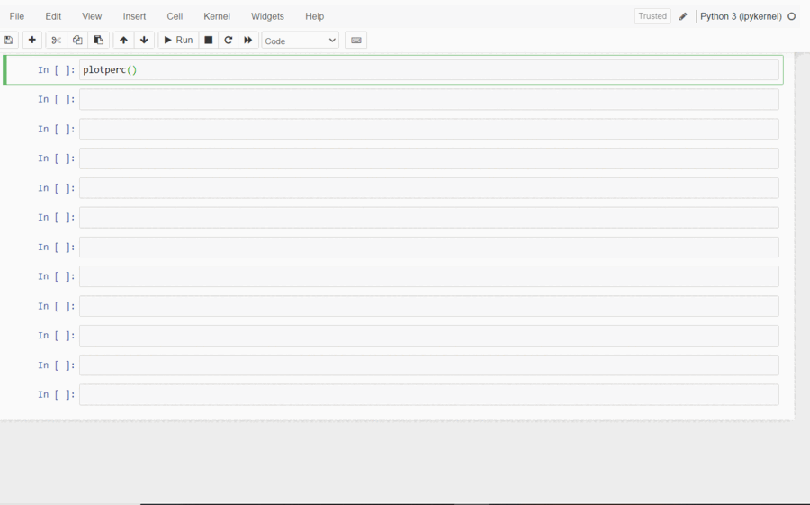
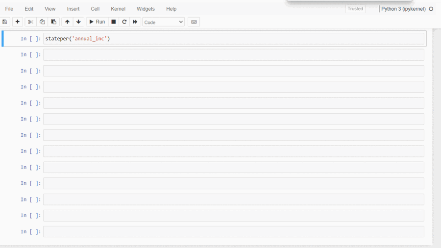

# Case Study

LendingClub is a peer-to-peer lending company headquartered in San Francisco, California.It was the first peer-to-peer lender to register its offerings as securities with the Securities and Exchange Commission (SEC), and to offer loan trading on a secondary market.

Here we face 2 main kinds of risks.
* If the applicant is **likely** to repay the loan, then not approving the loan results in a loss of business to the company

* If the applicant is **not likely** to repay the loan, i.e. he/she is likely to default, then approving the loan may lead to a financial loss for the company

We are commissioned to find conditions that cause an applicant to default.

## Table of Contents
* [General Info](#general-information)
* [Technologies Used](#technologies-used)
* [Conclusions](#conclusions)
* [Acknowledgements](#acknowledgements)
* [Demo](#Demo)
* [Author](#Author)

## General Information
- This case Study is a part of the couse the authors are pursuing at UpGrad in collaboration with IIIT (Banglore)
- In this case study, we will use EDA to understand how consumer attributes and loan attributes influence the tendency of default.
- We are provied with data containing featurs of loans that were **accepted** between 2007-2011 
- Our aim will be to find correlations between these featurs and come up with recommendations that lower the chances of default loans.

## Conclusions
#### As per our Analysis, we conclude that the main driving factors behind the loan charge offs are as follows:
* Term of the loan
* Interest rate applicable on the loan
* Annual income of the applicant compared to state average
* Purpose of the loan
* Loan Amount
* Credit hungriness of the applicant
* Bankruptcy and Derogatory records of the applicants
* Customer behavior aspects like high credit utilization and delinquency tendency. 

## Technologies Used
- IDE - Jupyter 
- Base language - Python 3.0
- Libraries in python used:
  * Pandas - version: 1.4.2
  * Matplotlib - version 3.5.1
  * Seaborn - version 0.11.2
  * Plotly - version 5.7

## Acknowledgements
Give credit here.
- This project was inspired by the steps and insights given to us during our live sessions and couse provied by UpGrad and IIIT(B)

## Demo
We have 2 Custom functions in this note book
1. plotperc()
This function accepts 3 vairable out of which 2 are optional
  1. Column name that you wish to analyse (mandatory)(String)
  2. Pivot Table output needed(optional)(bool)
   * If set True will return a Pivot Table on the Column name entered
   * False by defaul
  3. Barchart output needed(optional)(bool)
   * If det to False will disable the display of the Barchart
   * True by defaul

2. stateper()
This function accepts 2 vairable out of which 1 is optional 
  1. Column name that you wish to analyse against state average displayed in a chart per state
  2. Subset of Data_Lc that you wish to analyse.(optional)(DataFrame)

## Author
This repo was Coded formated and uploaded by a team of 2 students from the C39 batch of UpGrad AI and ML Post grad. in affilation with IIIT(B)
* Kush Naresh Lulla [ LinkedIn](https://www.linkedin.com/in/kush-lulla-74239611b/)
* Gautam Joshi [ LinkedIn](https://www.linkedin.com/in/gautam-joshi-610661139/)